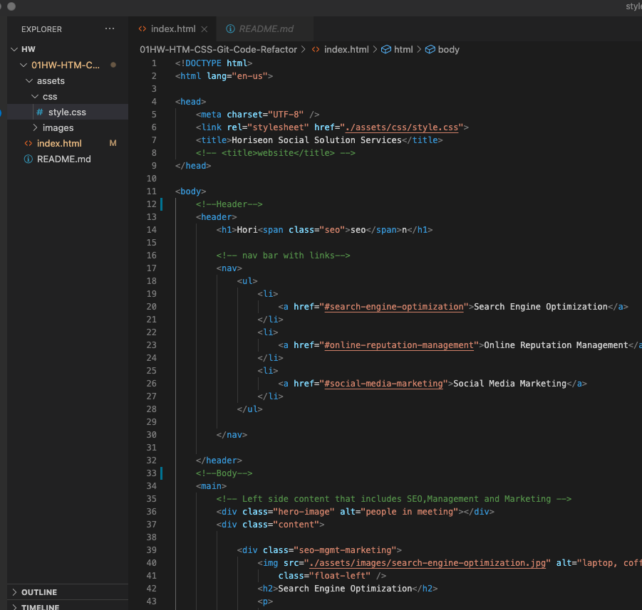
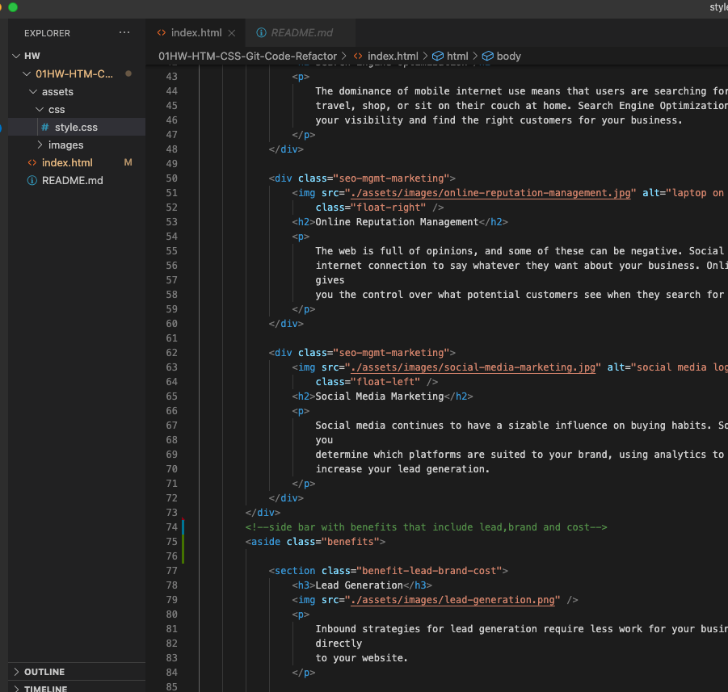
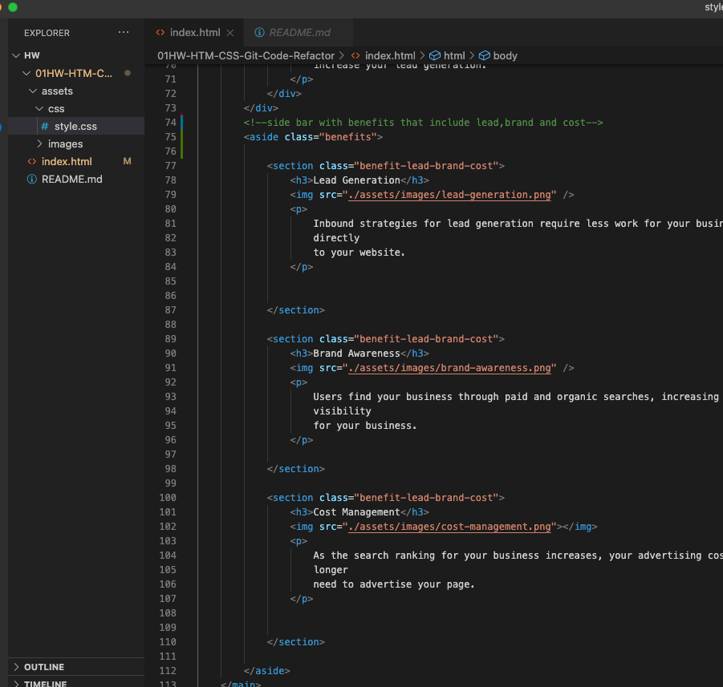
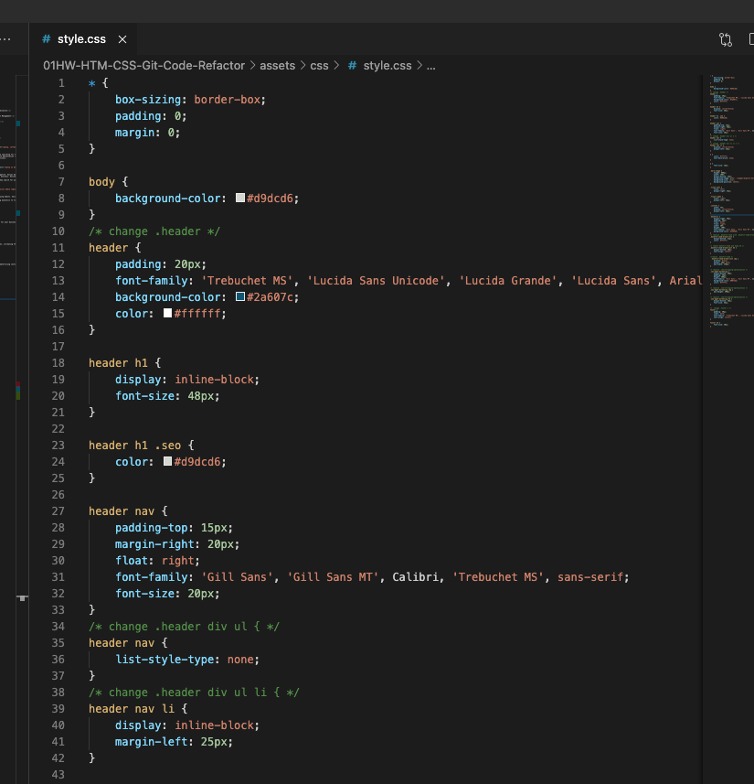
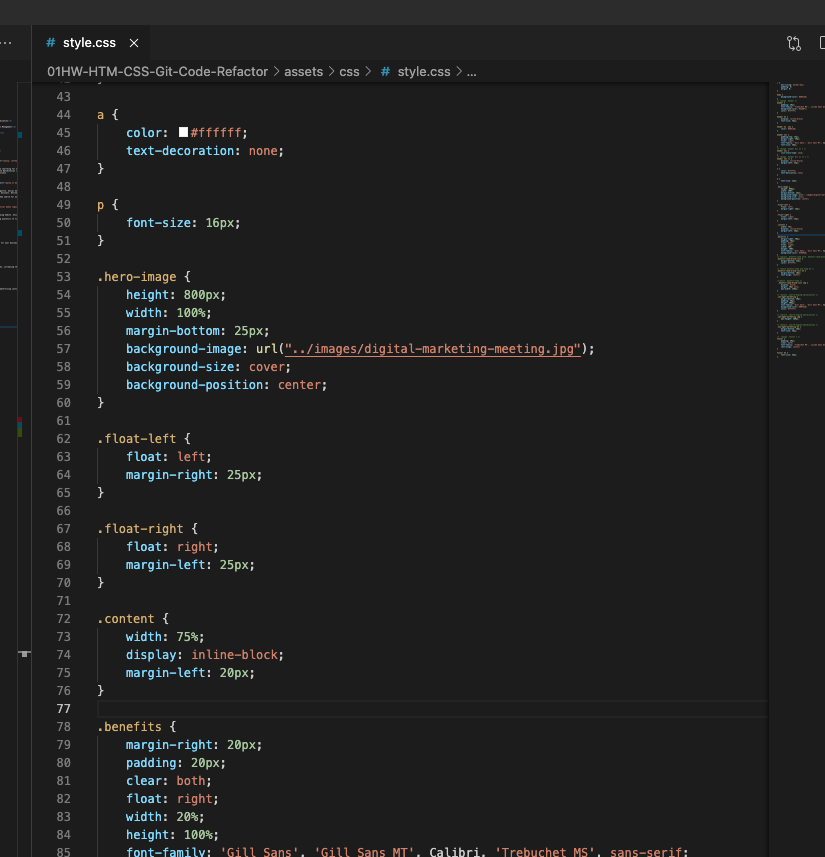
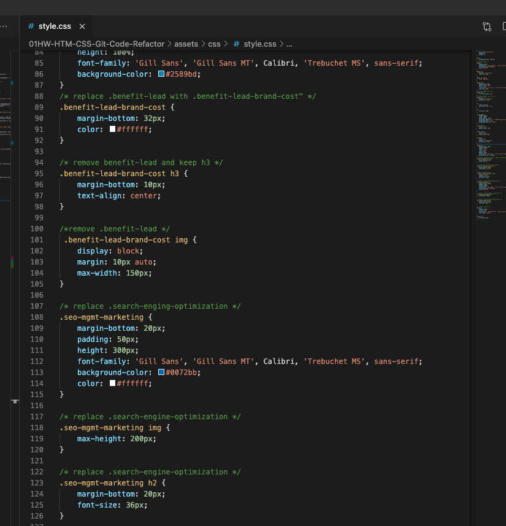

# 01HW-HTM-CSS-Git-Code-Refactor

## Table of Contents
1. [Title](#title)
2. [General Info](#general-info)
3. [Technologies](#technologies)
4. [Installation](#installation)
5. [Collaboration](#collaboration)
6. [Changes Made](#changes-made)

## Title
Horiseon is a SEO company that provides marketing and social media options for clients.

## General Info
The purpose of this task is to refactor the website so that it follows accessibility standards so that the site is optimized for search engines

## Technologies 
The site uses HTML and CSS code

## Installation
To access the website go to https://melelson.github.io/01HW-HTM-CSS-Git-Code-Refactor/
To clone https://github.com/MelElson/01HW-HTM-CSS-Git-Code-Refactor.git

# Collaboration 
Pull requests are encouraged. Please make sure to update as appropriate 

# Changes Made
Changes that were made to optimize the website
	• Title of website was updated to provide a more descriptive name of the company
	• Div elements were replaced with HTML elements that were more descriptive 
	• Elements were changed to follow a logical sequence which includes styling and positioning
	• Added alt attributes to images 
	• Condensed CSS code to remove redundant code that could be combined into one class with style to simply the flow and content of the file. 

### Changed HTML

### Changed CSS

### Website Snapshot

